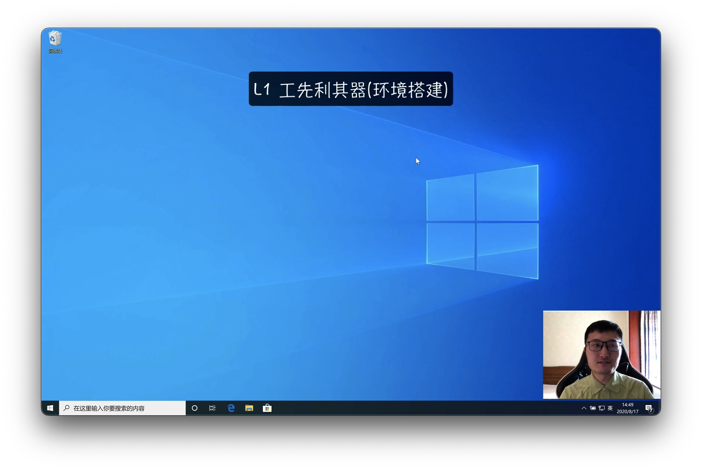
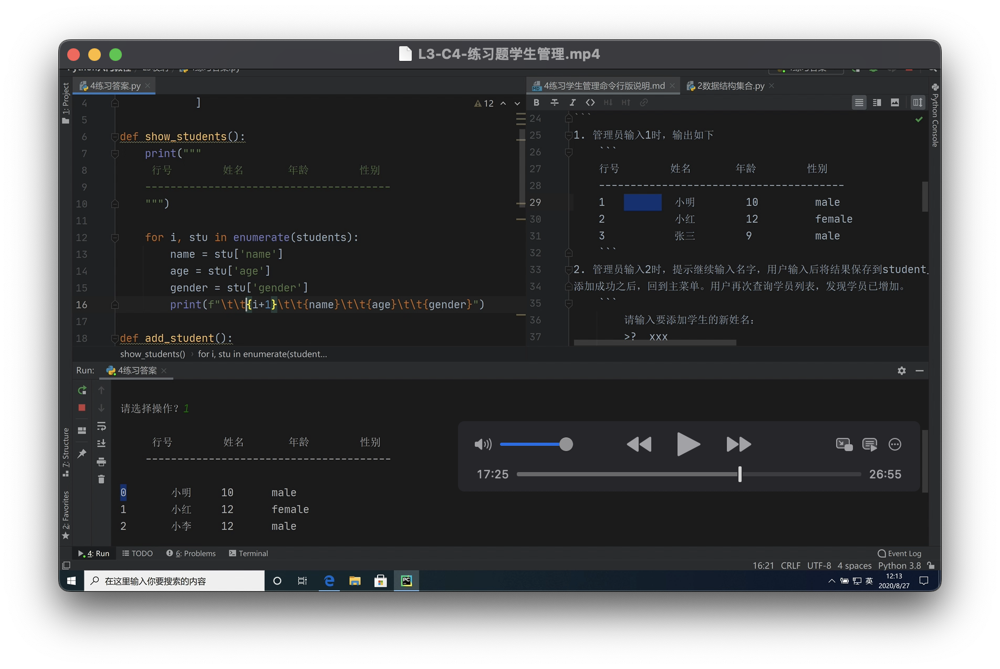
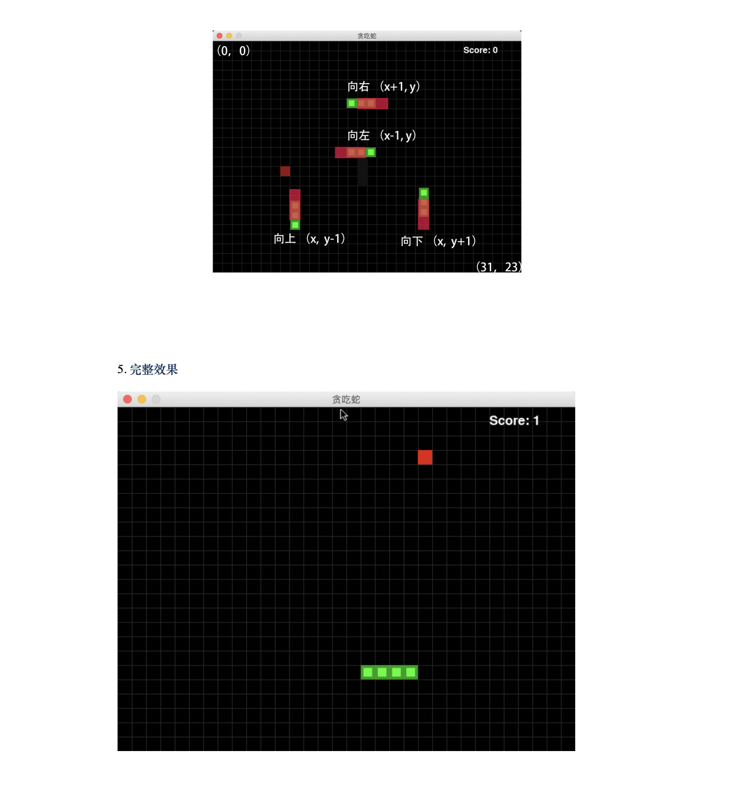

Python Basic Video Tutorial 
===
## Brief
Status:  
Year: 2020  
Language: Chinese 中文  
Format: recorded broadcast  
Watching Online:  [watching online](https://buckets.zyzypy.com/Python%E5%9F%BA%E7%A1%80/)  

Introduce: 
Python getting started tutorial for novices, contains python syntax foundation and a greedy snake game.  
介绍: 
面向无基础初学者的视频，包含python语法基础，命令行运行的简易版学生管理程序，最后用贪吃蛇游戏贯通前面的知识。
## Index
<!--lines aren't easy to align in pycharm markdown editor-->
| Index                                      | 目录                      |
|:-------------------------------------------|:------------------------|              
| L1-C1 Install Interpreter                  | L1-C1 安装解释器           |  
| L1-C2 Two ways to run code                 | L1-C2-运行代码的两种方式       |  
| L1-C3 Pycharm installation and usage       | L1-C3-集成开发工具安装使用      |  
| L2-C1 Basic Type                           | L2-C1-基本类型            |  
| L2-C2 String Format Output                 | L2-C2-字符串格式化输出        |  
| L2-C3 Select Branch                        | L2-C3-选择分支            |  
| L2-C4 Loop                                 | L2-C4-循环              |  
| L3-C1 Function                             | L3-C1-函数              |  
| L3-C2 Data Structure Container             | L3-C2-数据结构容器          |  
| L3-C3 Class and Object                     | L3-C3-类和对象            |  
| L3-C4 Exercise Question Student Management | L3-C4-练习题学生管理         |  
| L3-C5 Package Management                   | L3-C5-包管理             |  
| L4-C1 Game Greedy Snake                    | L4-C1-游戏架子            |  
| L4-C2 Main Logic                           | L4-C2-主要逻辑一           |  
| L4-C3 Main Logic I                         | L4-C3-主要逻辑二           |  
| L4-C4 Draw Elements                        | L4-C4-绘制各元素           |  
| L4-C5-Remaining Function                   | L4-C5-余下功能            |  

## Screenshot

## License
The Copyright belongs to my previous Company and Me.  
This is a promotional course, allow to watch it online, disallow to download.  
版权属于公司，著作权属于本人。由于是宣传招生视频，所以是可公开的，可以在线观看，有兴趣直接咨询前公司，不可下载。