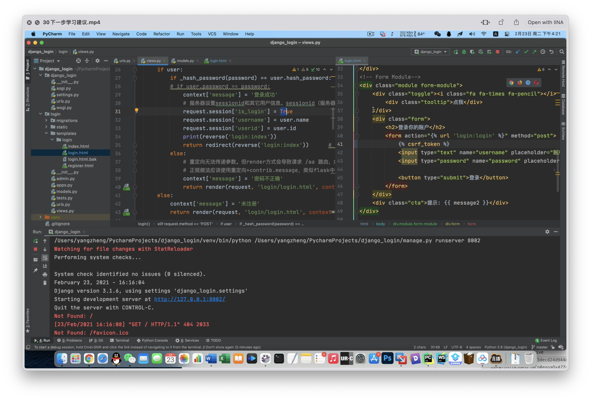
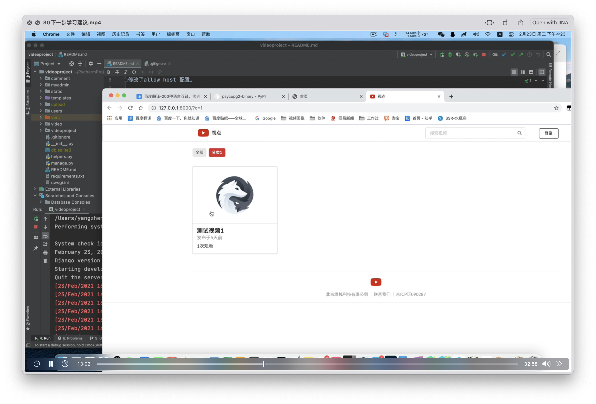
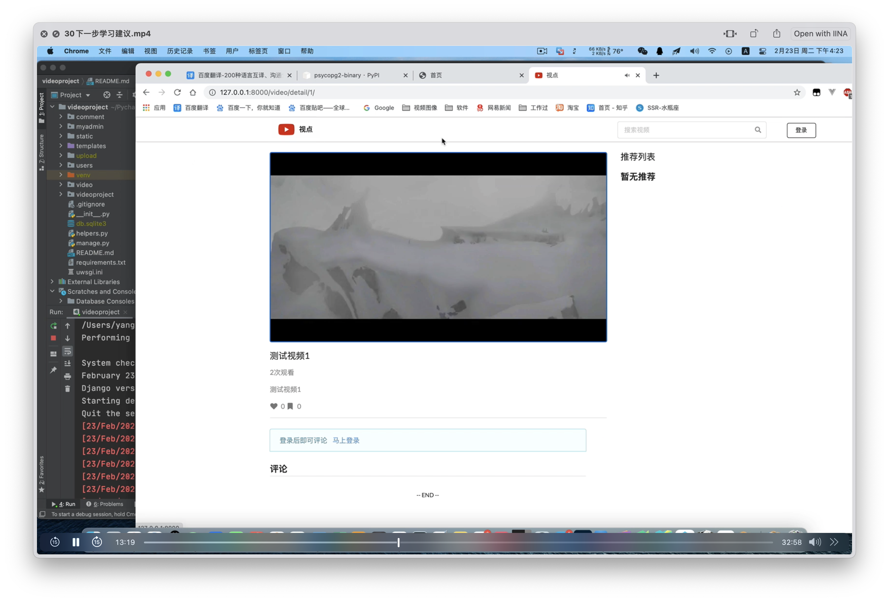
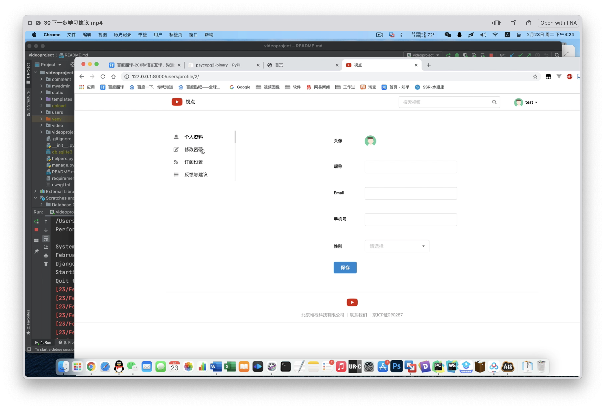

Python Web Crawler(Spider)
===
## Brief
Status:  
Year: 2021  
Language: Chinese 中文  
Form: live/campus teaching  
Watching Online: [watching online](https://buckets.zyzypy.com/python_django/)  

Introduce:  
The content covers the basics of Python and Django framework, a simple video website demo, but interspersed with advanced knowledge and the teaching speed is fast.
In particular, the "students" are university teachers. The course if for newly hired teacher, or an older teacher(assembly language, C language era) who has not studied Python ,
Their learning ability is very strong, and giving them lectures is also a bit stressful for me. But I am their teacher in Python field, I am also pleased to receive praise from my peers in the end.  
"Teacher Yang, to be honest, the school organized learning, and I intentionally chose this subject that I thought it was simple. I have also taught my students Python, and during the Spring Festival, 
I want to have a rest and not work too hard. However, after listening to your class, I found that there are many things that I didn't teach my students, and even I couldn't keep up with precess in the later stage of course."  
"Teacher Yang, the lecture was so smooth that I thought it was a recorded video. It wasn't until you interacted with the questions in the chat group while teaching, that I realized it was a live broadcast.
Is the portrait of you? Looking so young, I thought it was an older person with such a level."  
"Teacher Yang, the metaphorical example of 'cookies', emperor in costume drama(see the course for details), it's so fresh and appropriate. Did you invent it? Can I use it in my future teaching?"  

介绍:  
内容为Python基础和Django框架基础，但穿插了进阶知识，且讲课速度较快。  

这次课程的性质算是企业培训，培训对象为大学老师。“学生”是学校的新入职老师，或没接触过Python的年龄较大的老师（汇编语言、C语言时代），
他们的学习能力很强，给他们讲课我也是有点压力的。但是术业有专攻，在Python方面我是他们的老师，最后收到同行的夸赞也令我欣慰。  
“杨老师，说实话学校组织学习，我特意选了个以为简单的，我也教过学生python，春节期间想多休息，不想太费劲，打算混一下。但是听了你的课，发现很多东西自己
授课时没给学生讲过，到后面的课程，甚至自己有点跟不上了。”  
“杨老师，讲课这么流畅，我以为是录播课，直到你互动了聊天群里的提问，我才发现是直播。视频开头的照片是你吗，看着这么年轻，我以为是年纪更大的人才有这样的水平。”  
“杨老师，讲cookie时的比喻例子，古装电视剧中皇帝下江南风流玉佩（详见课程），好新鲜好恰当，是你发明的吗，我可以用在我今后的授课中吗？”  

## Index
Pre requirement: has foundational of Python and Frontend.   

| Index                                | 目录               |
|:-------------------------------------|:-----------------|
| 01 overview and interpreter          | 01 概述和安装解释器      |
| 02 two ways to run code              | 02 运行代码的两种方式     |
| 03 Pycharm                           | 03 集成开发工具pycharm |
| 04 basic data type                   | 04 基本类型          |
| 05 loop                              | 05 分支和循环         |
| 06 function                          | 06 函数            |
| 07 list                              | 07 列表            |
| 08 dictionary tuple                  | 08 字典元组          |
| 09 student management simple version | 09 学生管理命令行版      |
| 10 class                             | 10 类             |
| 11 encoding and handle local files   | 11 编码和读写本地文件     |
| 12 packages                          | 12 包             |
| 13 introduction of Web development   | 13 Web开发介绍       |
| 14 Django start                      | 14 Django框架初识    |
| 15 project organization              | 15 目录组织          |
| 16 view                              | 16 视图            |
| 17 ORM part.1                        | 17 对象映射模型1       |
| 18 ORM part.2                        | 18 对象映射模型2       |
| 19 ORM part.3                        | 19 对象映射模型3       |
| 20 ORM part.4                        | 20 对象映射模型4       |
| 21 admin tool                        | 21 管理后台工具        |
| 22 list page part.1                  | 22 问题列表页1        |
| 23 list page part.2                  | 23 问题列表页2        |
| 24 details page                      | 24 问题详情页         |
| 25 voting and results page           | 25 投票和结果页        |
| 26 debug                             | 26 调试模式          |
| 27 static files                      | 27 静态文件          |
| 28 upload files                      | 28 上传文件          |
| 29 postgre database                  | 29 大象数据库         |
| 30 next step suggestions             | 30 下一步学习建议       |

## Screenshot

## License
The Copyright belongs to my previous Company and Me.  
Allow watching online, disallow downloading.  
版权属于公司，著作权属于本人。可以在线观看，有兴趣直接咨询前公司，不可下载。

