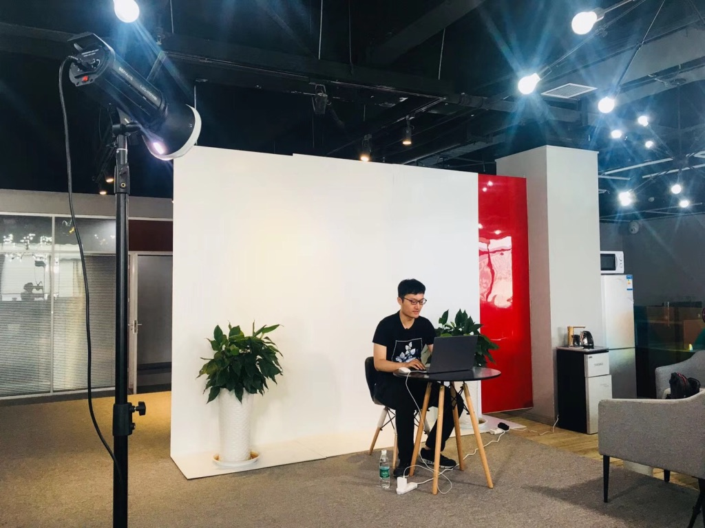

Python Flask Video Tutorial 
===
## Brief
Status:  obsoleted  状态：废弃  
Year: 2018  
Language: Chinese 中文  
Form: pre-recorded  
Handout:  [todo: Handout url](https://)  

Introduce:  
Python Flask tutorial, contains videos and handout. Both side terminate of cooperation midway for some reasons,
The video only has half the outline plan, and due to the early recording time, the content is outdated, 
thus don't put video up.  

介绍:  
Python Flask 框架教程，包含视频和图文讲义。我与合作方公司因故中途终止合作。视频仅录制计划进度的一半，加之已过去多年课程软件版本已过时，
因此状态为废弃，未上传视频。

## Index
| Index                                          | 目录                |
|:-----------------------------------------------|:------------------|
| L1 Getting to know Flask                       | L1 初识flask        |
| L2 A simple project named flaskr               | L2 一个简单的flaskr项目  |
| L3 Frontend foundational                       | L3 前端基础速通         |
| L4 Routing                                     | L4 路由             |
| L5 Request Context and Response                | L5 请求上下文与响应       |
| L6 Jinja2 template syntax                      | L6 jinja2语法       |
| L7 Form                                        | L7 表单             |
| L8 Database Fundamentals                       | L8 数据库基础          |
| L9 ORM and SQLAlchemy                          | L9 ORM对象映射模型框架    |
| (video process ends at here)                   | (视频进度至此)          |
| L10 Blueprints and Organizational Projects     | L10 蓝图和组织项目       |
| L11 Registration and login                     | L11 注册与登陆         |
| L12 Logging, debugging, unit testing           | L12 日志、断点调试、单元测试  |
| L13 Publish articles                           | L13 发表文章          |
| L14 Comments and pagination                    | L14 评论和分页         |
| L15 Additional functions                       | L15 追加功能          |
| L16 Overall testing, optimization, and closure | L16 整体测试，优化，收尾    |
| L17 Prepare for deployment                     | L17 准备部署          |
| L18 Linux Basic Operations                     | L18 linux基础操作     |
| L19 Public network access                      | L19 公网访问          |

## Screenshot

## License
The Copyright belongs to Me.  
