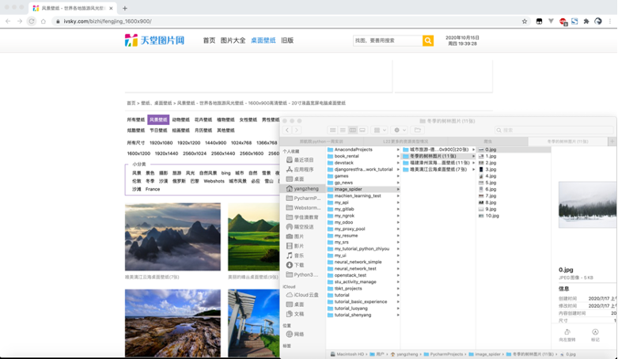
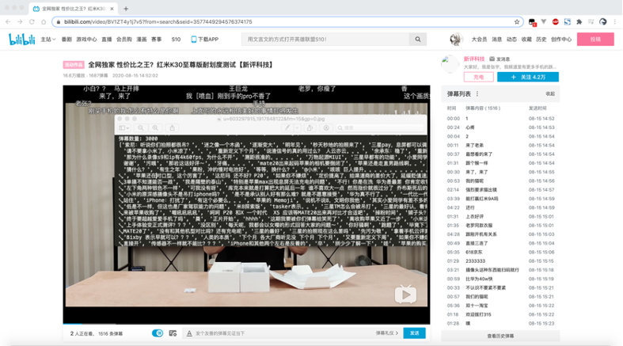
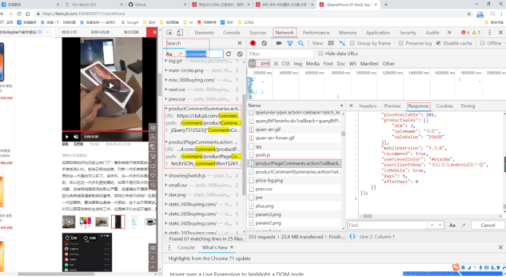
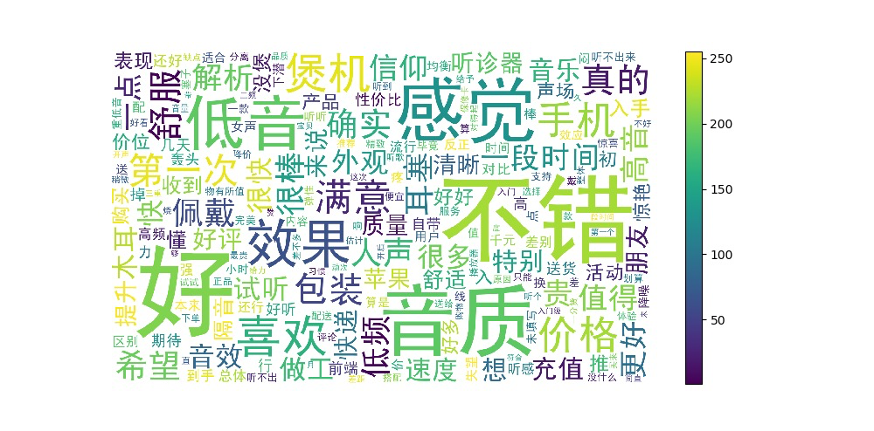
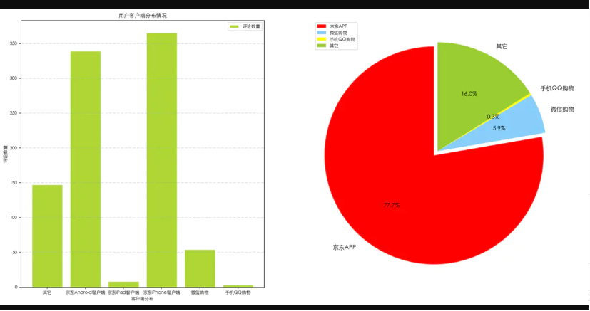
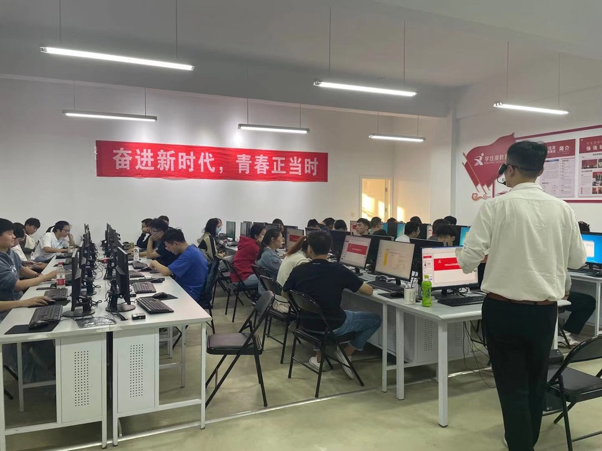

Python Web Crawler
===
## Brief
Status:  
Year: 2021  
Language: Chinese 中文  
Form: campus teaching  
Watching Online: [watching online](https://buckets.zyzypy.com/python_spider/)  

Introduce:  
This is a short-term practical training course for school enterprise cooperation, which focuses on the basics of crawling/spider 
and includes several practical examples.  

Schools and students like this kind of course that takes a short time and can gain the effect (data, visualization) immediately.
Not willing to spend time learning web framework, database, and frontend. Without a web foundation,
In addition to running the ready-made code in class, their problem-solving ability has not been exercised. 
Students often encounter difficulties by website anti-crawler measures, and unknown parameters, 
and a large amount of request information in Chrome developer kit.
I don't recommend learning crawler before learning web development.  

介绍:  
这是校企合作的短期实训课，内容为爬虫基础，包含几个实战小例子。  

学校和学生喜欢这种耗时短，能马上看到效果（数据，可视化）的项目。不愿花时间学习Web框架、数据库、前端，在没有Web基础的情况下，
除了照着既定的课上代码运行出效果，自己解决问题的能力并没有得到锻炼，他们常常被网站的反爬虫措施和不明意思的参数和谷歌浏览器开发者
工具中大量的请求信息所困。我的另一份注重基础的方案被学校以看上去不够高大上拒绝，我对学校这种风气表示担忧。我并不建议在学习Web开发前
学习爬虫课程。

## Index
Pre requirement: has foundational of Python and Frontend.   
 
| Index                                       | 目录              |
|:--------------------------------------------|:----------------|
| day 1                                       | 第一天             |
| 1 overview                                  | 1 概述            |
| 2 read plain text file                      | 2 读纯文本文件        |
| 3 text encoding                             | 3 文本编码历史        |
| 4 encode and decode                         | 4 encode和decode |
| 5 read/write plain text file                | 5 写纯文本文件        |
| 6 read/write blob file                      | 6 读写非文本文件       |
| 7 base64 encoding                           | 7 base64编码      |
| day 2                                       | 第二天             |
| 1 http protocol                             | 1 图解http        |
| 2 Chrome developer kit                      | 2 谷歌浏览器开发者工具    |
| 3 pip                                       | 3 pip包管理        |
| 4 usage of lib requests                     | 4 requests库使用   |
| 5 several ways of HTML parsing part.1       | 5 html解析的几种方式   |
| 6 several ways of HTML parsing part.2       | 6 html解析之xpath  |
| day 3                                       | 第三天             |
| 1 Fried Egg Joke crawler                    | 1 煎蛋笑话网爬虫       |
| 2 NetEase News headline news crawler        | 2 网易新闻头部标题爬虫    |
| 3 NetEase News hotspot ranking news crawler | 3 网易新闻热点排行爬虫    |
| 4 usage of lib os                           | 4 os库           |
| 5 Paradise Image crawler                    | 5 天堂图片网爬虫       |
| 6 Paradise Image crawler 2                  | 6 天堂图片网爬虫2      |
| 7 Paradise Image crawler 3                  | 7 天堂图片网爬虫3      |
| day 4                                       | 第四天             |
| 1 JD reviews analysis                       | 1 京东评论分析        |
| 2 JD reviews analysis 2                     | 2 京东评论分析2       |
| 3 JD reviews analysis 3                     | 3 京东评论分析3       |
| 4 json                                      | 4 json格式        |
| 5 request weather website API               | 5 请求天气接口        |
| 6 JD reviews js API analysis                | 6 京东评论js接口      |
| day 5                                       | 第五天             |
| 1 js class crawler                          | 1 js接口类爬虫作业     |
| 2 Sqlite database                           | 2 sqlite数据库     |
| 3 Sqlite database 2                         | 3 sqlite数据库2    |
| 4 reviews persist to database               | 4 京东评论爬虫数据库版    |
| 5 Jieba word segmentation                   | 5 jieba分词       |
| 6 stop word dict                            | 6 停止词           |
| day 6                                       | 第六天             |
| 1 reviews emotional estimation              | 1 评论感情色彩估算      |
| 2 generate word cloud chart                 | 2 词云图           |
| 3 usage of chart lib Pygal                  | 3 pygal图表       |
| day 7                                       | 第七天             |
| students oral defense                       | 学生答辩            |

## Screenshot
  
  
  
  
  
  

## License
The Copyright belongs to my previous Company and Me.  
This is a promotional course, allow to watch it online, disallow to download.  
版权属于公司，著作权属于本人。由于是宣传招生视频，所以是可公开的，可以在线观看，有兴趣直接咨询前公司，不可下载。  

