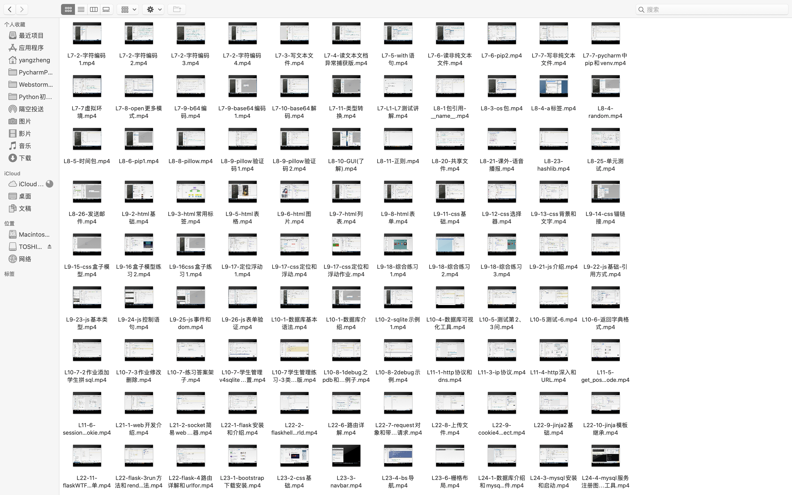
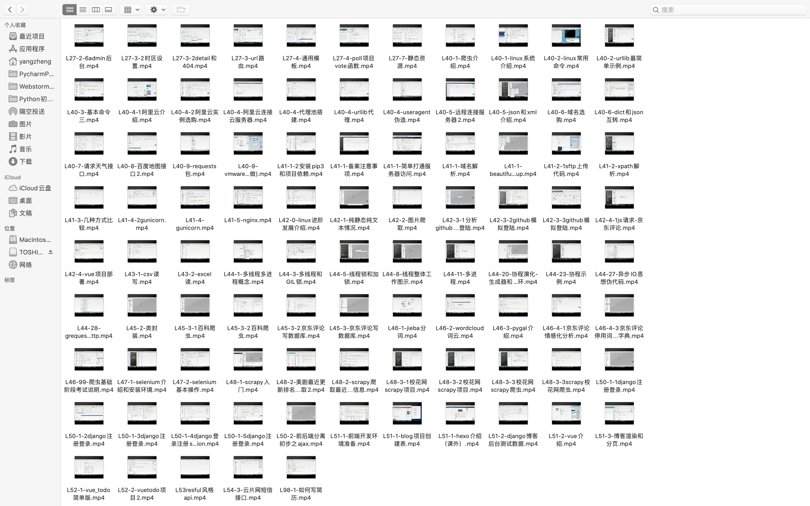
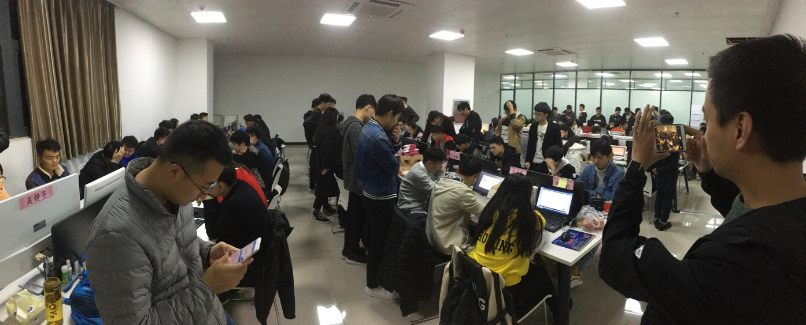
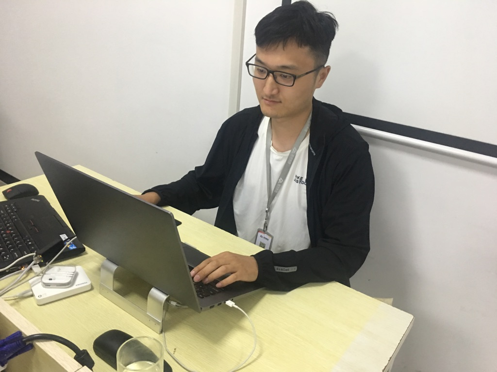
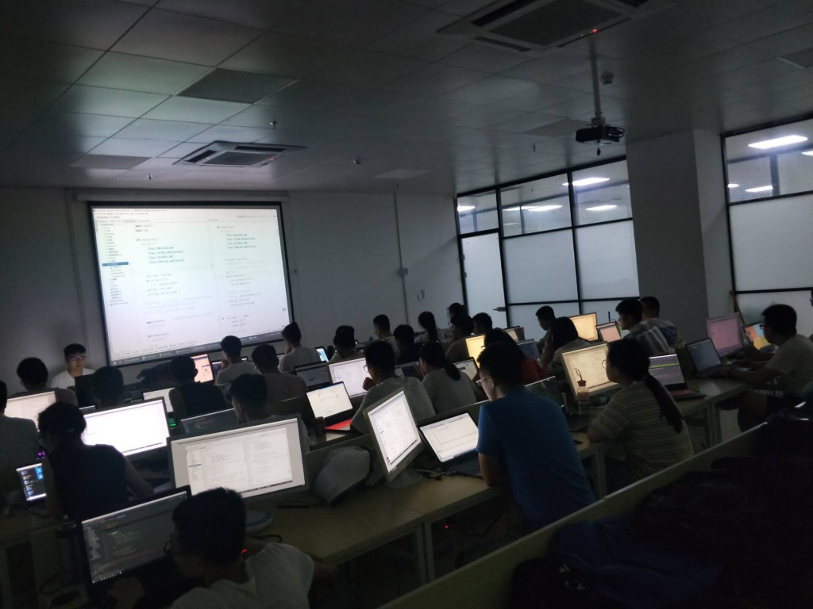

Python Web Full Stack
===
## Brief
Status: depreciate  
Year: 2018 2019  
Language: Chinese 中文  
Format: campus teaching  
Watching Online: not provided  
Handout: not provided  

Introduce:  
Led a class and taught for half a year, the course is comprehensive, which is a good exercise for myself.
I fully devote myself to teaching students and have feelings for them.  
The course is not public or promotional,thus videos is not provided.  

介绍: 
初入讲师行业，赶上中国国内Python培训热潮的末期，完整带了一个班，教了半年，知识系统全面，对自己是很好的锻炼，全力以赴教学生，对学生也有感情。  
视频不是公开宣传性质、加上课上实录时间长节奏慢、有底噪、文件大、软件版本已过时，因此不提供视频。

## Index
Due to the large amount of content, only a rough outline is provided.  
由于内容较多，仅提供粗略大纲。  

| Index                                | 目录           |
|:-------------------------------------|:-------------|
| Section1 Python foundations          | 第一章 Python基础 |
| Section2 Frontend and Database basic | 第二章 前端和数据库基础 |
| Section3 Web Flask framework         | 第三章 Flask框架  |
| Section4 Crawler                     | 第四章 网络爬虫     |
| Section5 Web Django framework        | 第五章 Django框架 |
| Section6 Server basic and Deployment | 第六章 服务器基础与部署 |
| Section7 Employment support          | 第七章 就业支持     |

## Screenshot

## License
The Copyright belongs to my previous Company and Me.  
This is a promotional course, allow to watch it online, disallow to download.  
版权属于公司，著作权属于本人。由于是宣传招生视频，所以是可公开的，可以在线观看，有兴趣直接咨询前公司，不可下载。