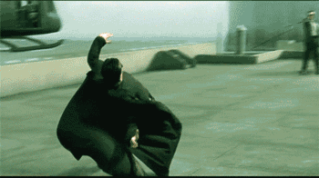
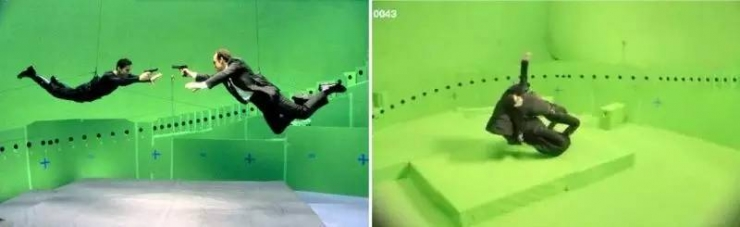
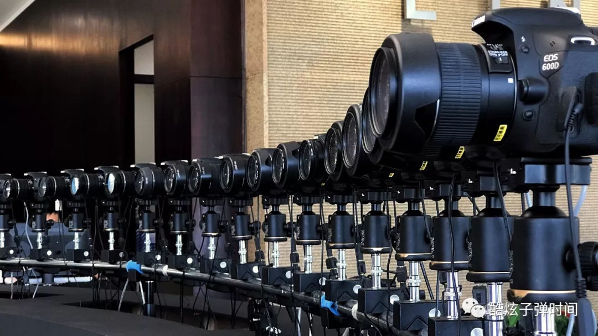
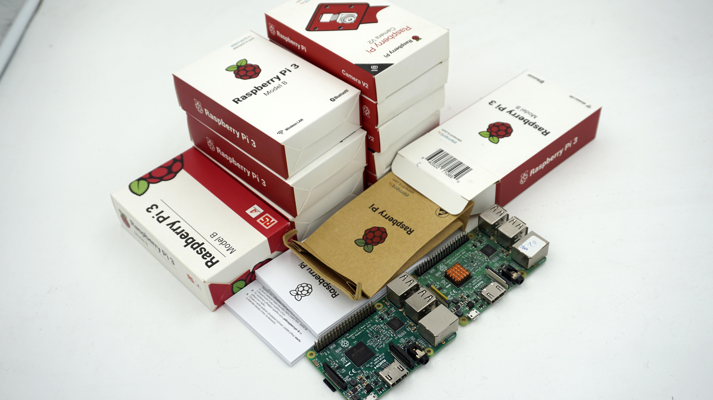
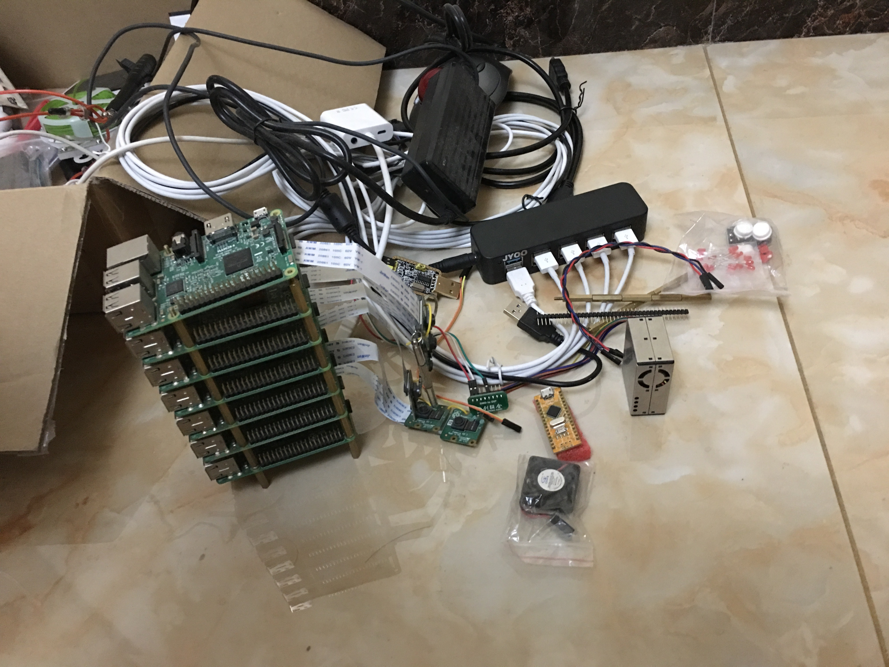

Bullet-Time with Raspberry-Pi Capture Rig  
===
## Introduction
Status: Obsolete
Time: 2016
Code: private
Demo: None

Occasionally received private work, a very creative project, Party A wanted to use the Raspberry Pi to realize a 
low-cost bullet-time shooting array.
Party A has shot bullet-time in places such as the China CCTV Spring Festival Gala (around 2017) and movies ("Once Upon a Time").

> Bullet time is a camera technology used in movies, TV commercials or computer games to simulate variable speed effects,
> such as enhanced slow motion, time still and other effects.
> The "bullet time" effect became famous for its use in the movie "The Matrix" produced by Warner Bros. Pictures in Hollywood. 
> The slow-motion shot of the hero Neo leaning back to avoid bullets is a classic, hence the name "Bullet Time".

  
After hearing the demand, Party A said that it needed 200 machines, which surprised me. Immediately I thought, 
can't one camera go around a circle on the track? After thinking about it again, I realized that if the person is stillness, it is fine,
but the demand needs a 360° at a certain moment when "the person is moving", it's indeed needs a circle rig of cameras.  
  
Canon and Nikon has a ready-made solution, but it also requires software licensing fee and hardware costs，which is very expensive💵.
Only film shooting and large parties can afford it.  
  
So the demand I received was a "low-cost RaspberryPi-based" Bullet Time, I'm just responsible for taking pictures and 
collecting pictures, without compositing, making prototypes, and without considering the actual venue shelf construction.
  

## technology stack
Hardware:
- Raspberry Pi 3B       *Several 
- Camera with 800w pixel(Raspberry Pi official kit)       *Several
- Multi-port USB bulk charger
- Router

software:  
- Linux
- Flask

Technical Difficulties:  
- niche:  
Google couldn't find relevant information, only a foreign company was working on Raspberry Pi Bullet Time, 
and GitHub didn't find any code. The algorithm is not automatic when the Raspberry Pi camera is shooting,
and the aperture and exposure parameters need to be manually passed. Wade across the stream by feeling the way.  
- Batch:
Difficulty changes after batches. At the beginning, I thought it was very simple. The Raspberry Pi works well with its 
official camera. The command line or python package can call the camera to take pictures, and then use the os lib 
to save the pictures taken once.
After doing it, I found that once the machines amount goes up, the workload will increase rapidly. 
The planned number of machines is 200, and eight are used for the development of the Demo, 
the number can't be too small otherwise the effect cannot be seen good after picture composition.
Finally, I wrote the PLC(programmable logic controller,Desktop computer) control end and the IPC (industrial PC,Raspberry Pi) receiving end. 
I didn't think of any good solution for automatically assigning IP, because the returned pictures need to be composition in certain order, 
so manual numbering and fixed IP. OS image also need to be modified, the Arm structure OS on Raspberry Pi is not as easy to operate as the traditional linux system. 
It needs to customize the image, but there is no device can flash SD cards in bulk even though I went around TaoBao.
The script for the automatic code update of the IPCs is not written, maybe now days should I be able to write some scripts or k8s management?
The hardware management, debugging, and testing of multiple machines all increase meanwhile the number increase, hence the workload is actually very large.
- Parallel(not concurrent):
After the implementation of the function was accepted by Party A, they said that the capture time of the returned set of photos was inconsistent, 
and the final composition would lead to blurring. Compared with the stopwatch test, it is found that the maximum error of the photo is 100ms.
This is not a big deal for web pages, but it is fatal under this specific demand. Changing the code on PLC to asynchronous or multithreading has little effect.
Later, it was found that expensive wireless routers are much better than cheap ones, and it is best to plug in network cables. At this time, it was controlled to 30ms.
But after that, I can't go any further. Checking the information, it is related to the main frequency of the CPU of the Raspberry Pi and the timeit function in python.
Use single-chip microcomputer and C language seems to achieve smaller errors.

Hardware during development:

## end
Party A later cooperated with a company to realize the bullet time of the mobile phone version. 
The camera of the mobile phone can autofocus, the group control is mature, and the second-hand price is not expensive. 
It seems to be a better choice than the Raspberry Pi.  

One day, the boss of Party A suddenly started posting pictures of anti-CCP remarks in WeChat Moments, 
which would result be put in jam in China, and the company website couldn't open after 2018. 
I'm irresponsibly guessing that while he was conducting company business, he came into contact with some dignitaries and
suffered impairment of benefit.I haven't contacted him since the project ended.

This is one of my most proud projects, just like the game pioneering. But it's a semi-finished products, 
many places are not automated, so the status is 'Obsoleted'. Now there is no energy to refactor, and there is no equipment to reproduce.

## License
The copyright belongs to Part A company, which has applied for a patent. Only discloses the project introduction. 
The source of the pictures is from the Internet or the information disclosed by Party A.

基于树莓派拍摄阵列的子弹时间
===
## 简介
状态：废弃  
时间：2016  
代码：私有
Demo：无

偶然间接到的私活，极有创意的项目，甲方想用树莓派实现低成本的子弹时间拍摄阵列。
甲方在春晚(2017左右)和电影(《三生三世十里桃花》)等地方拍摄过子弹时间。  

> 子弹时间是一种使用在电影、电视广告或电脑游戏中的摄影技术模拟变速特效，例如强化的慢镜头、时间静止等效果。
> "子弹时间"效果因在好莱坞华纳兄弟电影公司出品的电影《骇客帝国》中大量使用名声大噪。男主角Neo仰身躲子弹的慢动作镜头堪称经典，"子弹时间"也因此得名。  

  
刚听过需求后，甲方说需要两百台机器，令我惊讶，马上想到不能一台摄像机沿着轨道转圈吗？再想想后才明白，如果人静止可以，但需要"人正在运动"的某瞬间的360º，
就只能一圈摄像头了。  
  
佳能公司有现成解决方案，但也需要高额的软硬件费用高成本。因此非常烧钱💵。为了最终成品几秒钟的美丽，往往用在电影中。  
  
所以我接到的需求是 "基于树莓派的低成本"子弹时间，只用负责拍照和图片收集，不需要合成，做出原型，不需要考虑实际场地架子搭建。  

## 技术栈
硬件：  
- 树莓派3B     若干台
- 树莓派官方套件-摄像头-800w像素      若干台
- 多口USB批量充电器
- 路由器

软件：  
- Linux
- Flask

技术难点：  
- 小众：  
谷歌搜不到相关信息，只搜到国外有一家公司在搞树莓派子弹时间，GitHub没有搜到任何代码。树莓派摄像头拍摄时算法不自动，需要手动传光圈、曝光参数。
模石头过河。  
- 批量：  
难度在批量之后发生变化。刚开始时我想的很简单，树莓派和其官方摄像头搭配很好，命令行或python包就可以调用摄像头拍照，然后用os包把一次拍照的图片存下来。
做之后发现，一但量上去后，工作量会快速上升。机器计划台数200台，开发Demo使用八台，数量太少合成后看不出效果。
最后写了上位机(电脑)控制端，下位机（树莓派）接收端。自动分配IP没想到什么好的解决方案因为回传图片需要按顺序最终合成，所以人工编号，固定IP。系统镜像
部分设置也需要修改，树莓派的arm系统并不如传统linux系统好操作，需要自定义镜像，找遍淘宝没有批量SD卡读写器。
下位机自动更新代码的脚本没写，现在应该会写些脚本或k8s管理？
多台机器硬件管理，调试，测试，都随数量上升而上升，工作量其实很大。  
- 并行：  
实现功能给甲方验收后，对方说返回的一组照片时间不一致，最终合成后会导致模糊。注意不是并发是并行。对照秒表测试，发现照片误差最大100ms。
这对于网页不算什么，但在这个特定需求下是致命的。控制端的拍照命令代码改为异步或多线程，收效甚微。
后来发现贵的无线路由器比便宜的好许多，而插网线最好，这时控制到了20ms。再小就解决不了了，查资料竟然跟树莓派CPU的主频和python中的timeit函数有关，
使用单片机+C语言才能达到更小误差。  

开发时的硬件:  

## 结尾
甲方后来找公司实现了手机版的子弹时间，手机的摄像头质量好，群控成熟，二手价格也不贵，似乎是比树莓派更好的选择。  
甲方老板某天突然开始在微信朋友圈发反CCP言论图片，这在中国国内是会进公安局的，公司网站在2018年后就打不开了。我不负责地猜测他在进行公司业务时，
接触到了一些权贵，受到了一些利益损害。项目结束后我与他没再联系过，不了解情况。

这是我最得意的项目之一，就像游戏中的开荒。但是半成品，很多地方没有自动化，因此状态为'废弃'。现在没有精力重构，也没有设备复现。  

## License
版权属于甲方公司"上海无不维文化创意"，已申请专利，仅公开项目介绍，文章图片来源为网络或甲方公开的资料。