UI Works
===
Status: Obsoleted 废弃  
Year: 2014  

If you are curious about why a coder work on UI, click mouse right button to translate website.  

## 入门教材自学
大学计算机专业毕业后，进入一家公司开发ERP，主要使用Java和SAP Abap。复杂的需求，落后的技术架构，作为新人技术不够，让工作难以进行并对编程失去兴趣。
离职后看到了UI设计，我喜欢漂亮的东西，也想改变ERP交互的不合理。  

那年中国互联网热潮正兴起，企业开始要求软件美观吸引人，UI是新工种，招聘很少，培训机构刚开始办但培训费贵，没有中文图书教材。
这时有位外号叫Y总的人在网上免费教UI和解决思路，我跟了几节课有一点意识后，在网上选择了唯一一本教UI的入门教材《App手机界面创意手机新手通》
（其它教UI的教材内容其实是教平面），进行练习，自学。学习了Photoshop，绘制图标，界面。用户交互方面看的有《Don't make me think》《About Face3》。  
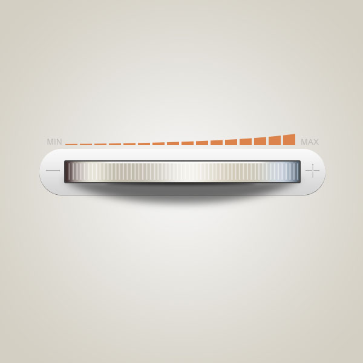
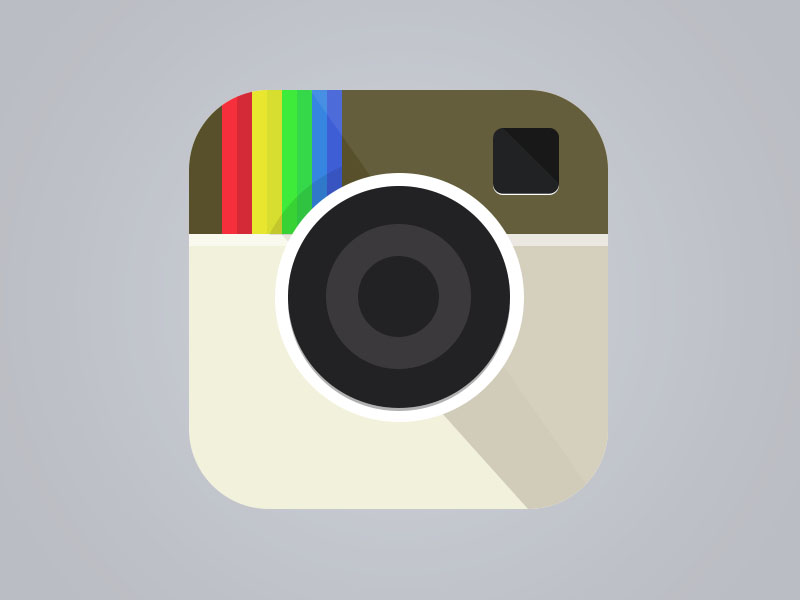
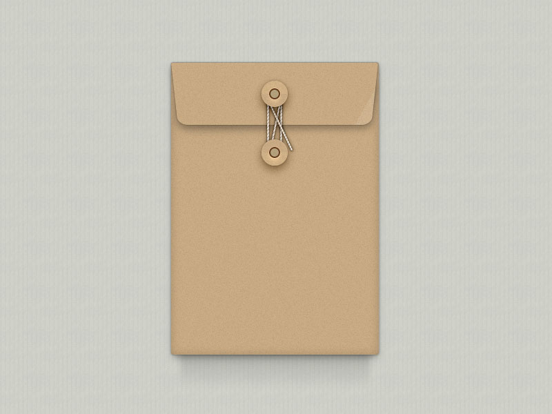
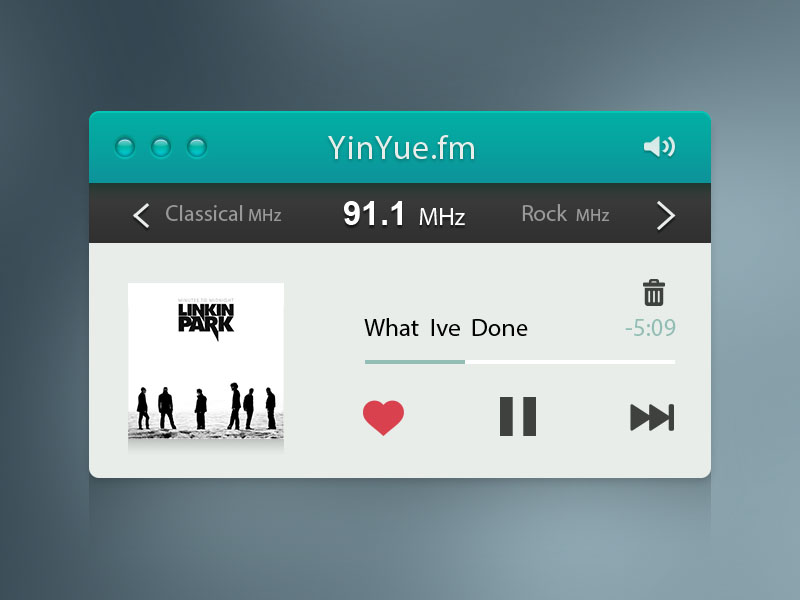
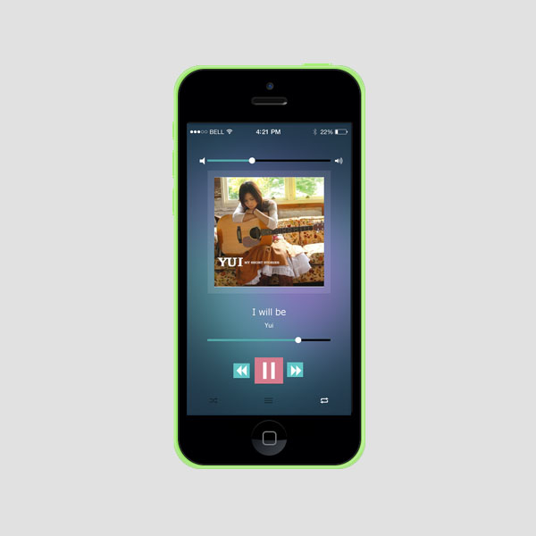
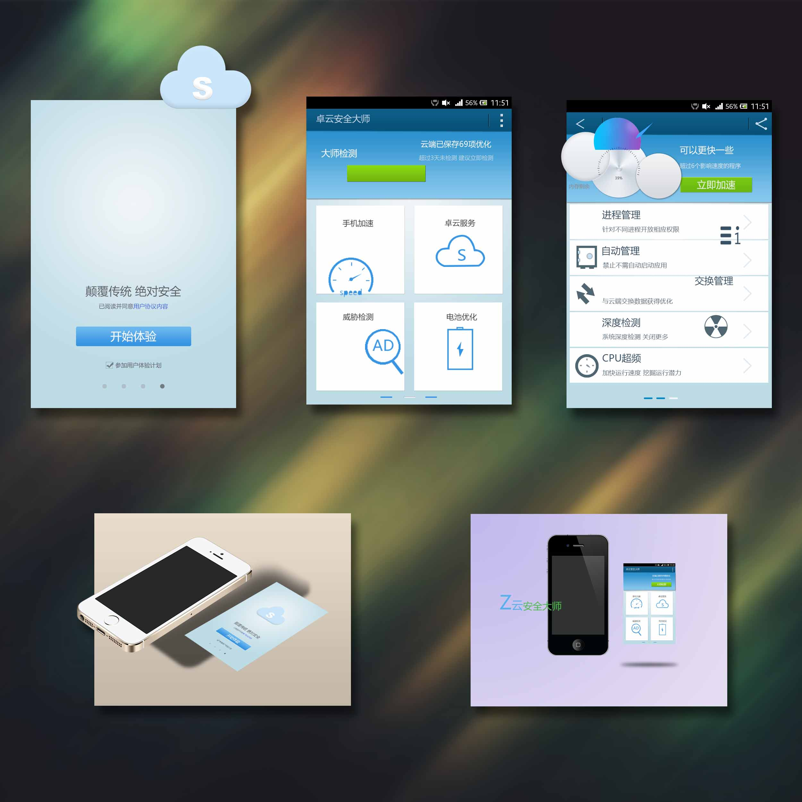
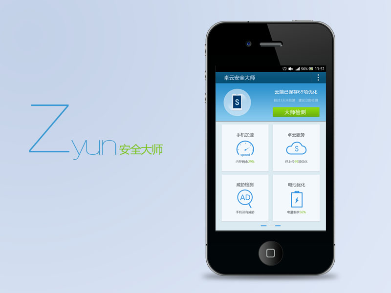
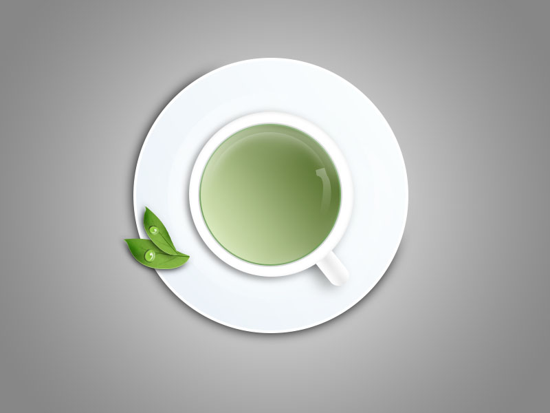
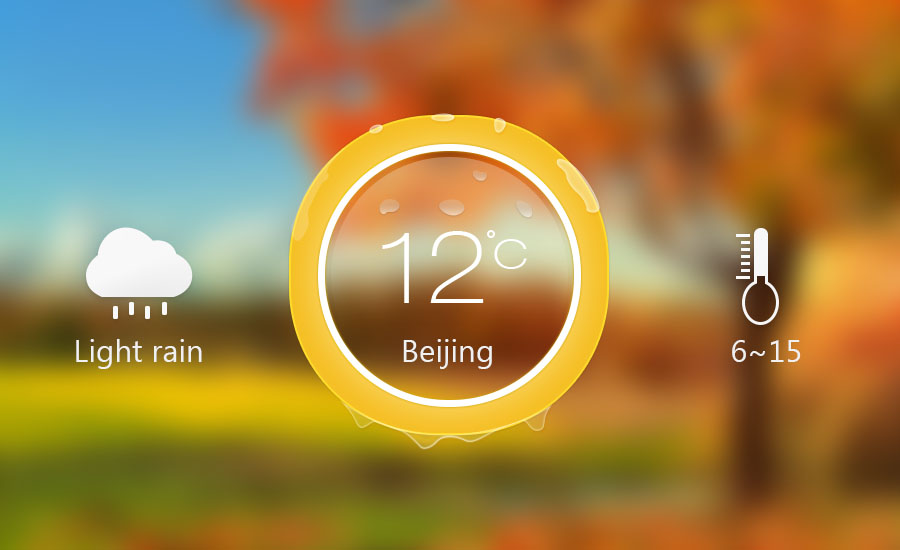
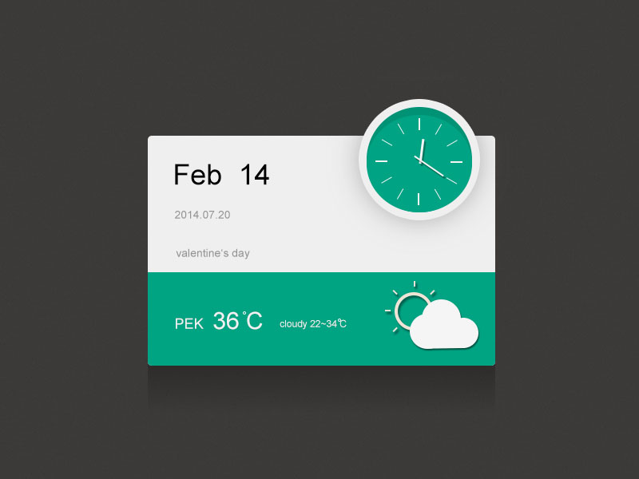

license: 图片属于教材。

## 接私活
自学完基础后，我的城市属于软件三线城市，UI招聘不到三家公司。我面试了一家其实招的是前端，另一家公司嫌我没经验。
这时我到威客类网站上自己接项目积累经验，自己负责谈项目、谈需求，负责整个周期很爽。
参与到了几个在今天看也颇具创意的项目。最后由于刚起步赚钱少被观念传统的家长终止了。  

### Xbox体感手势检测的看房软件
甲方很高兴我知道Xbox🎮是什么（他找的上一位女设计师不理解导致没有合作）和理解手势操控的项目意图，图标要大。很高兴看到了结果。

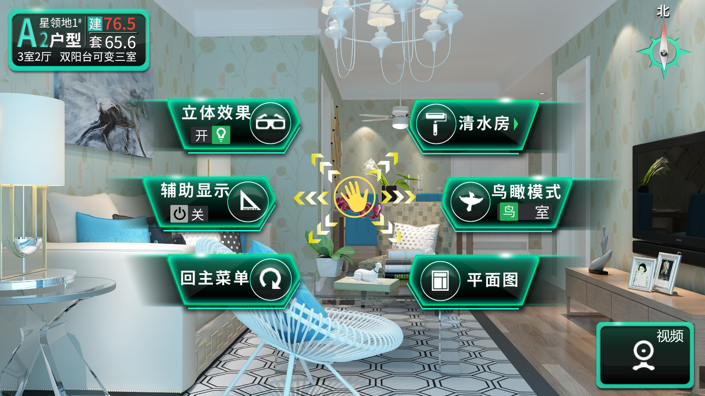
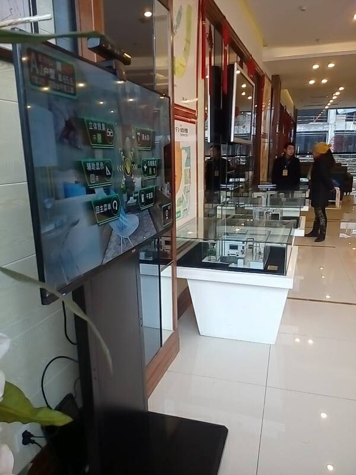
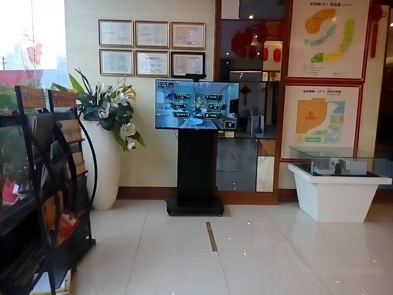

### 酒运达App
UI在半年时间内快速兴起，市场火爆，培训机构的招生老师甚至都去学，培训两个月即可工作。我进入到了一家做卖酒App的互联网公司。当时行业仍然处于刚起步，
安卓手机分辨率众多，设计人员和开发人员根据像素进行开发，逻辑像素、手机UI库都还没有出现，Sketch、Figma、标注工具、墨刀、图标网站，全部刚刚出现。
我摸索出一套工作方法，每日看站酷网、Dribbble网锻炼审美，使用最新的软件技术工作， 配合公司安卓和IOS开发人员。
在Photoshop老版本中，甚至导出一个图标不同分辨率都是件耗时的工作，且包含元信息导致文件过大，后来才出了针对UI工作的导出为功能和画板功能，
再后来才有Sketch等专门做UI的工具。 相信我，在当时中国国内，这界面算漂亮了。  

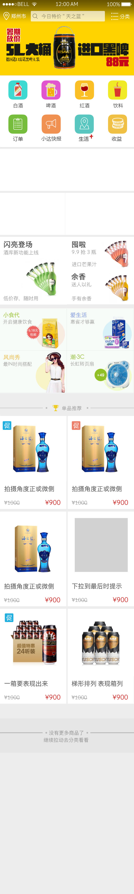
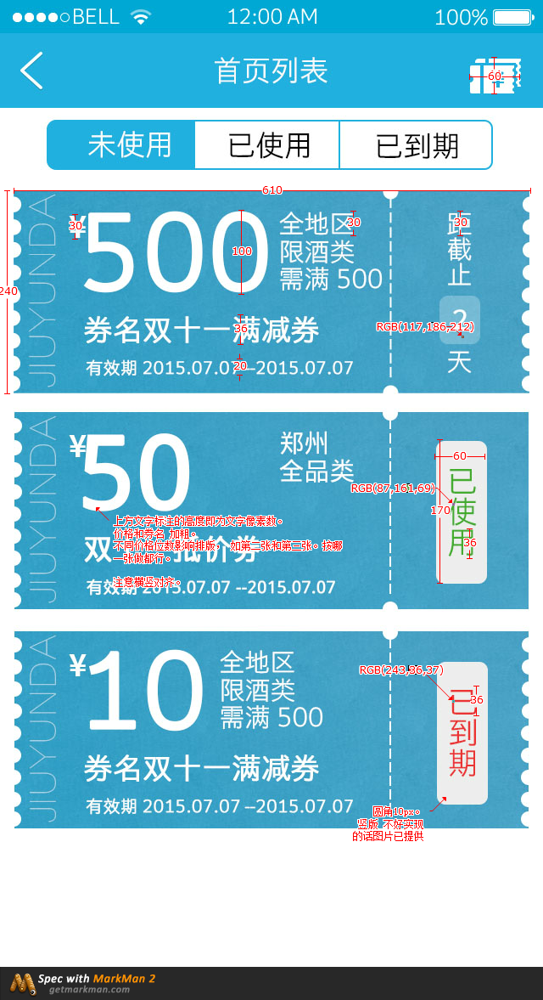
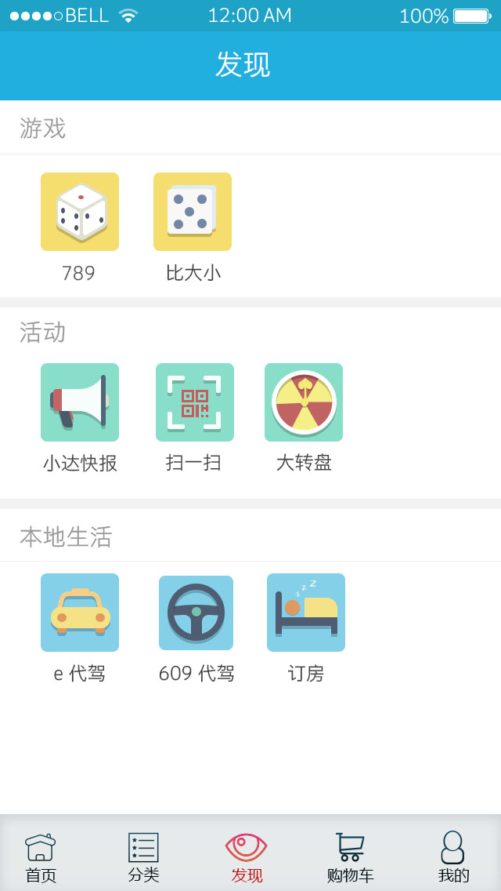
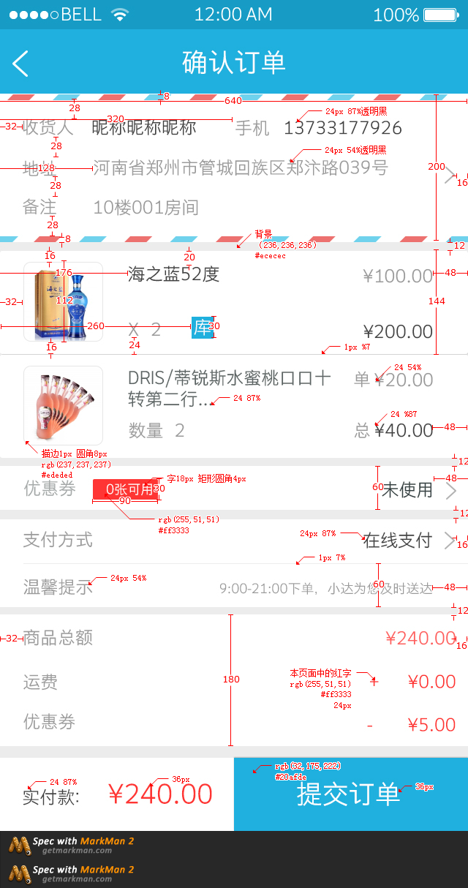

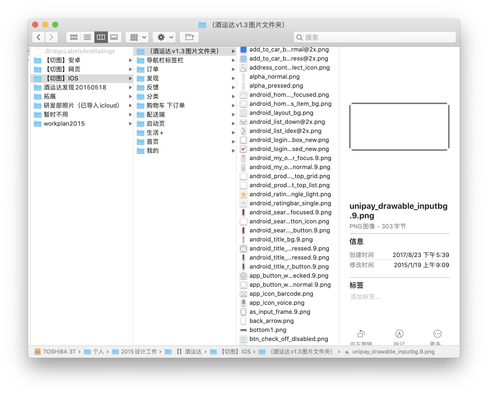

license: 公司已倒闭，超过两年的职务作品，根据当地法律可以公开。

## 离开UI行业
干了半年后，公司高层变动，我被拉到新项目组，赶上热潮发展快，升为设计组长，下属有几位从培训班出来的新人。新管理画大饼，我当时同时做几个项目，带新人，
累到食指抽筋，工资画大饼几个月后涨。另一方面，自觉不是美术出身，拼素材上限有限，脑子里想的思路手表达不出来。再一方面，所在城市没有大公司，一个团队顶多招一位UI，升职机会有限。
最后想了想，系统学美术来不及，还是要干编程本行。  

再之后，市场中UI迅速饱和，要求开始升高，美术基础、动效软件、3D软件都要会。我退出的也算及时。  

今天的软件，再也不是当初没工具、没经验、没人才的时候了，当初的设计在今天看已经算丑的了，因此本作品状态为"废弃"。

我很喜欢这段工作经历，看美图、作图，比编程轻松愉快。不光要把软件功能做出来，美观易用也很重要，把一个产品做到90%，比70%要多花几倍精力，
我们应该追求最终的体验，国内很多软件，功能做了一大堆但并不好用。  

虽然离开了这行，但我留下了审美、交互、产品的能力，看到一个软硬件产品，知道它为什么好看，为什么易用，为什么合理，为什么不合理，都能在书中找到理论支持，
而不是"审美是主观的，萝卜白菜各有所爱"。平时生活中在选择电子产品、家具时，我都会选择简洁而不简单的、符合美学的，一眼看出产品有没有设计师参与。
现在我是苹果的粉丝，买了特斯拉汽车，家中许多小米家居的小家电，甚至桌子上笔记本支架、咖啡棒、钥匙链、装汽车玻璃水的瓶子，我都会刻意选择，为生活增添一点情趣，自己看着也舒心。